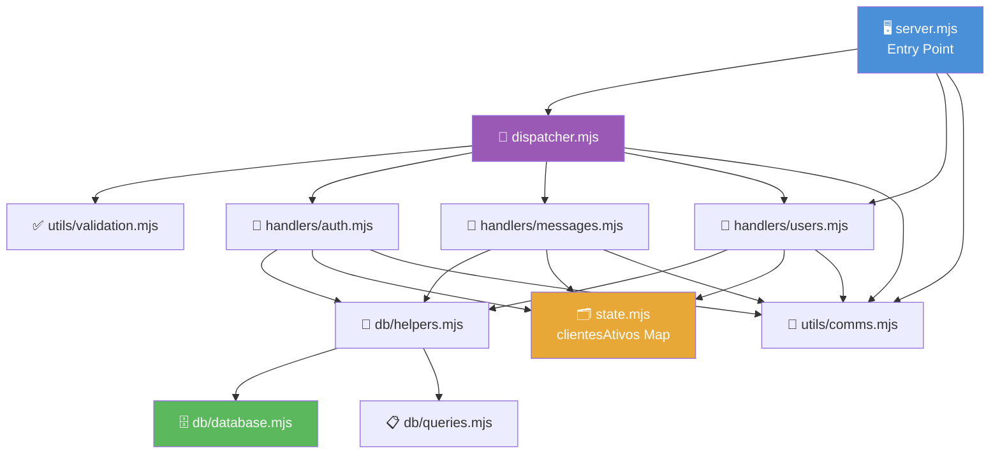
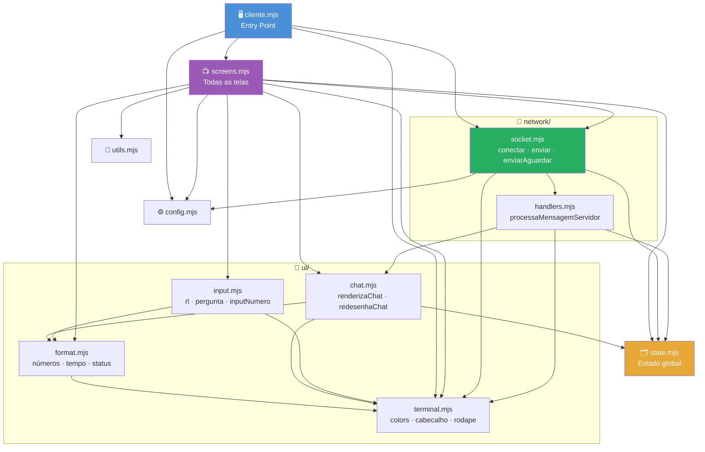
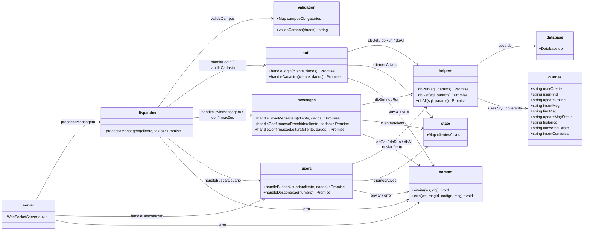
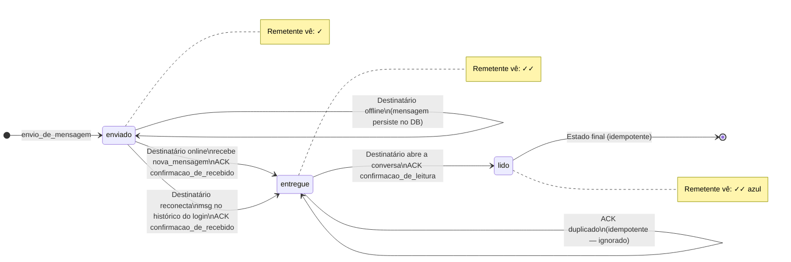
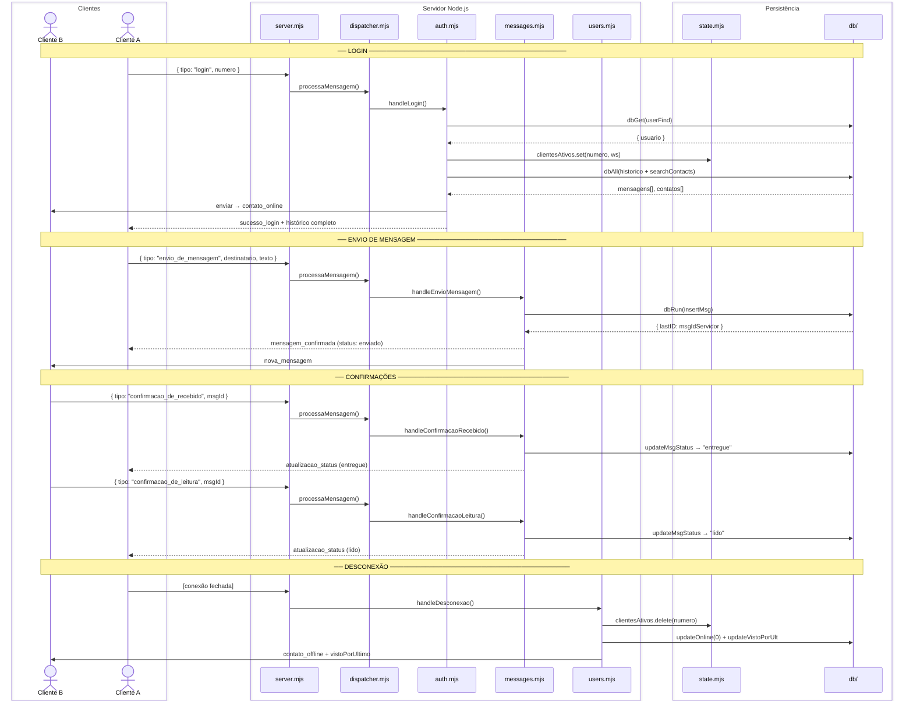

<div align="center">

# 📱 mini Local Zap

**A terminal-based instant messaging system inspired by WhatsApp's core functionality**


> First Assignment — Distributed Systems at UENF  
> Professor Dr. Luis João Almeida Filho

</div>

---

## 📋 Table of Contents

- [Overview](#-overview)
- [Features](#-features)
- [Architecture](#-architecture)
  - [System Topology](#system-topology)
  - [Server Modules](#-server-modules)
  - [Client Modules](#-client-modules)
  - [Module Contracts](#-module-contracts)
  - [Message Lifecycle](#-message-lifecycle)
  - [Runtime Flow](#-runtime-flow)
- [Database Schema](#-database-schema)
- [Technical Decisions](#-technical-decisions)
- [Known Limitations](#-known-limitations)
- [How to Use](#-how-to-use)
- [Assignment Requirements](#-assignment-requirements)
- [What Would I Do Differently](#-what-would-i-do-differently)

---

## 📖 Overview

**mini Local Zap** is a terminal-based instant messaging system that simulates the core behavior of WhatsApp — without a graphical interface, without a browser, and without the cloud. It runs entirely over a local network.

The project was developed as the first assignment for the Distributed Systems course at UENF. The goal is to practice distributed systems concepts by implementing a multi-client application communicating with a server, covering:

- State synchronization across multiple clients
- Event and exception handling
- Network communication protocols
- Concurrency and disconnection tolerance

---

## ✅ Features

| Feature | Status | Notes |
|---|---|---|
| User registration | ✅ Done | Phone number as unique ID |
| User identification (name + nickname) | ✅ Done | No authentication required |
| Send text messages | ✅ Done | Terminal input |
| Receive text messages | ✅ Done | Real-time push via WebSocket |
| Delivery confirmation | ✅ Done | `enviado` → `entregue` on reconnect |
| Read confirmation | ✅ Done | `entregue` → `lido` on open |
| Conversation history | ✅ Done | Retrieved from SQLite |
| Offline message queuing | ✅ Done | Delivered on reconnect |
| Concurrent users | ✅ Done | Multiple simultaneous connections |

---

## 🏗️ Architecture

The system follows a classic **client-server architecture** with three separated components.

### System Topology

```
┌──────────────────────────────────────────────┐
│                  LOCAL NETWORK               │
│                                              │
│   ┌──────────┐        ┌──────────────────┐   │
│   │ Client A │◄──────►│                  │   │
│   └──────────┘        │     Server       │   │
│                       │   (Node.js +     │   │
│   ┌──────────┐        │   WebSocket)     │   │
│   │ Client B │◄──────►│                  │   │
│   └──────────┘        └────────┬─────────┘   │
│                                │             │
│                       ┌────────▼─────────┐   │
│                       │  SQLite3 (DB)    │   │
│                       └──────────────────┘   │
└──────────────────────────────────────────────┘
```

| Component | Responsibility |
|---|---|
| **Client** | Terminal UI, send/receive messages, send ACKs (entregue + lido) |
| **Server** | Route messages, manage connections, update message states, notify senders |
| **Database (SQLite3)** | Persist users, messages, conversation relationships |

---

### 🗂️ Server Modules

The server code is split into focused `.mjs` modules. Edges are declared in topological order so the graph reflects the true dependency hierarchy with minimum crossings.



Key design decisions visible in this graph:

- `state.mjs` is the **single owner** of the active-connections map — no handler duplicates it
- `dispatcher.mjs` is a **pure router** — it only imports handlers, never touches the DB directly
- `db/helpers.mjs` is the **only module that touches the SQLite connection**, keeping DB access centralized

---

### 🗂️ Client Modules

The client follows the same layered philosophy. The `network/` and `ui/` subgraphs group cohesive modules, and `screens.mjs` aggregates all screen functions to avoid circular navigation dependencies.



Notable design choices:

- `screens.mjs` is intentionally **one file** — splitting screens would create circular navigation dependencies (`telaChat ↔ telaConversas`)
- `handlers.mjs` defines its own local `enviar()` to break the potential cycle with `socket.mjs`
- `state.mjs` exports a **mutable object** (`const state = {}`) so all modules share the same reference — the correct pattern for live bindings in ESM

---

### 📐 Module Contracts

The `direction LR` layout aligns the five dependency layers left-to-right, eliminating the crossings that `direction TB` creates when long edges skip layers (e.g., `server → comms` jumping over handlers). Classes and edges are declared in topological order to guide dagre's column assignment.



The three handler modules (`auth`, `messages`, `users`) share the same dependency signature — `helpers + state + comms` — which makes adding a new handler entirely predictable.

---

### 📨 Message Lifecycle

`direction LR` transforms the state diagram into a horizontal timeline, making the progression natural to read left-to-right. Self-loops render as arcs above/below each state without obstructing the main flow.



All transitions are **idempotent**: a duplicate ACK never corrupts the message state.

---

### ⏱️ Runtime Flow

Participants are ordered as `B, A | server chain | STATE, DB` — a crossing-minimization analysis over the full interaction set found this arrangement reduces arrow crossings by ~4% compared to the original ordering. `box` groups create visual lanes separating clients from the server pipeline.



Notice how `dispatcher.mjs` is the **single entry point** for every incoming message — no handler is ever called directly from the WebSocket event.

---

## 🗄️ Database Schema

Three tables persist all server-side state. Field names match exactly what the code uses.

```sql
-- Usuários registrados no sistema
CREATE TABLE IF NOT EXISTS Usuario (
    numero          TEXT PRIMARY KEY,       -- e.g. "+5522912345678"
    nome            TEXT NOT NULL,
    apelido         TEXT NOT NULL,
    online          BOOLEAN DEFAULT 0,      -- 1 se há uma conexão ativa agora
    vistoPorUltimo  TIMESTAMP               -- NULL enquanto online
);

-- Pares de usuários que já trocaram mensagens ou adicionaram um ao outro
CREATE TABLE IF NOT EXISTS ConversaCom (
    id      INTEGER PRIMARY KEY AUTOINCREMENT,
    numero1 TEXT NOT NULL,
    numero2 TEXT NOT NULL,
    FOREIGN KEY (numero1) REFERENCES Usuario(numero),
    FOREIGN KEY (numero2) REFERENCES Usuario(numero)
);

-- Mensagens trocadas entre usuários
CREATE TABLE IF NOT EXISTS Mensagem (
    id           INTEGER PRIMARY KEY AUTOINCREMENT,
    msgIdCliente TEXT,                      -- ID gerado pelo cliente (idempotência)
    texto        TEXT NOT NULL,
    remetente    TEXT NOT NULL,
    destinatario TEXT NOT NULL,
    status       TEXT DEFAULT 'enviado',    -- 'enviado' | 'entregue' | 'lido'
    time         TIMESTAMP DEFAULT CURRENT_TIMESTAMP,
    FOREIGN KEY (remetente)    REFERENCES Usuario(numero),
    FOREIGN KEY (destinatario) REFERENCES Usuario(numero)
);
```

### Relationships

```
Usuario ──< ConversaCom >── Usuario
   │                            │
   └────────< Mensagem >────────┘
         (remetente / destinatario)
```

- `ConversaCom` is a **symmetric join table**: a row `(A, B)` covers messages in both directions
- `msgIdCliente` allows the server to detect duplicate sends from unstable connections
- `online` and `vistoPorUltimo` are updated atomically on connect/disconnect so clients always receive fresh presence data on login

---

## ⚙️ Technical Decisions

### 1. Protocol: WebSocket — Why?

Simply because it was the easiest to implement alone within the time available.

However, to be technically honest: **gRPC would have been the better choice** for this project. Here's why:

The professor restricted browser-based systems. That restriction removes gRPC's main real-world limitation — native browser incompatibility. Since this runs terminal-only, there is technically no reason not to use gRPC.

| | WebSocket | gRPC |
|---|---|---|
| Contract | ❌ None — untyped JSON | ✅ `.proto` file — enforced schema |
| Serialization | JSON (`JSON.stringify`) | Binary Protobuf (~5–10× more compact) |
| Streaming | ✅ Bidirectional | ✅ Bidirectional (native) |
| Browser support | ✅ Native | ❌ Requires gRPC-Web + proxy |
| Terminal support | ✅ | ✅ |
| Type safety | ❌ | ✅ Compile-time errors |

> **Bottom line:** WebSocket was chosen for simplicity. gRPC is the technically superior choice for a terminal-only system, especially for anything that would go to production.

---

### 2. Language: JavaScript (Node.js) — Why?

The ideal language for this project is **Rust** (no garbage collector, true parallelism, better scalability). But since the goal was to deliver a working system within the deadline, Node.js was chosen due to familiarity.

| Language | Performance | Concurrency Model | Complexity |
|---|---|---|---|
| **Rust** | 🥇 Highest | True parallelism, no GC | High |
| **Go** | 🥈 Very high | Goroutines (lightweight threads) | Medium |
| **Node.js** | Medium | Event loop (single thread) | Low |

Node.js handles I/O-bound workloads (like chat) well. The event loop limitation only becomes a real bottleneck at tens of thousands of simultaneous connections — far beyond the scope of this assignment.

---

### 3. Database: SQLite3 — Why?

It's a JavaScript library. All you need is:

```bash
npm install
```

No Docker, no external service, no configuration. Chosen to keep the project simple and easy to test on any machine.

**The trade-off:** SQLite3 does not support concurrent WRITE operations. For production scale, PostgreSQL (ideally via Docker) would be the right choice, since it handles concurrent writes properly.

> **SQLite3 is the bottleneck of this project.** However, supporting a high number of simultaneous users is not a requirement for this assignment — so it is an acceptable trade-off.

---

## ⚠️ Known Limitations

| Limitation | Reason | Production Fix |
|---|---|---|
| No authentication | Out of scope | JWT + bcrypt |
| No encryption | Out of scope | TLS + E2E encryption |
| SQLite write bottleneck | Simplicity | PostgreSQL |
| No group chats | Out of scope | — |
| Terminal only (no GUI) | By design (assignment rule) | React Native / Flutter |
| Single server instance | Simplicity | Load balancer + Redis pub/sub |

---

## 🚀 How to Use

### Prerequisites

- Node.js 18+
- npm

### Installation

```bash
git clone https://github.com/Zadoque/mini_local_zap
cd mini_local_zap
```

### Running the Server

```bash
cd servidor
npm install
npm start
```

The server starts on port `8080` by default.

### Running a Client

```bash
cd cliente
npm install
npm start
```

You will be prompted to:
1. Enter the server IP and port (defaults to `127.0.0.1:8080`)
2. Register or log in with your phone number
3. Start chatting

### Running Multiple Clients (same machine)

Open multiple terminal windows, `cd cliente`, and run `npm start` in each one.

---

## 📚 Assignment Requirements

<details>
<summary>Click to expand full assignment specification</summary>

### Minimum Viable Product

The system must allow:

1. **User registration and identification.** Each user must have a unique ID (phone number), name, and nickname. No complex authentication or cryptography required.

2. **Sending messages.** A user must be able to send text messages to another user. Each message must contain at least: sender, recipient, text content, send timestamp, and message state (`enviado`, `entregue`, or `lido`).

3. **Delivery confirmation.** The system must indicate whether the message was effectively delivered to the recipient and display its current state.

4. **Conversation history.** Messages exchanged between two users must be retrievable.

5. **Network communication.** The system must work with clients and server(s) communicating over a network. Allowed protocols: Sockets, WebSocket, RPC, or RMI. HTTP may be used, but browser-based web systems are not allowed. The programming language is free to choose.

### Technical Requirements

1. **Distributed solution.** The system cannot be a single local program with everything in the same memory. There must be separation between at least a client and a server — ideally including a separate database/persistence server.

2. **Concurrency support.** Two users connected simultaneously, exchanging messages at nearly the same time, with correct status updates.

3. **Disconnection tolerance.** If the recipient is offline, the system must handle this consistently:
   - Message remains as `enviado`
   - Upon reconnection, transitions to `entregue`
   - Upon opening the conversation, transitions to `lido`

### Evaluation Criteria

1. Does the system fulfill the minimum requirements?
2. Do the delivery and read confirmations work correctly?
3. Is the component separation well thought out?
4. Did the team understand the problems of communication, concurrency, and synchronization?
5. Is the code organized and does it handle failures? (Documentation is not mandatory.)
6. All members of the pair must know the software and understand its architecture and the purpose of each part of the code.

### Project Defense

The pair must present the system as a product, covering its main advantages and disadvantages. The code must be available on GitHub at least 4 days before the presentation. The pair must explain how they modeled the message flow, how they solved delivery and read confirmations, which limitations still exist, and where the system may fail. A live demo is preferred, but a video is acceptable as a fallback.

</details>

---

## 🔄 What Would I Do Differently

If this project had a larger scope, more time, or a larger team, these would be the upgrades:

| Area | Current | Ideal |
|---|---|---|
| Protocol | WebSocket + JSON | **gRPC + Protobuf** |
| Language | Node.js | **Rust + Tokio** |
| Database | SQLite3 | **PostgreSQL via Docker** |
| Scalability | Single server | **Load balancer + Redis pub/sub** |
| Security | None | **TLS + JWT + bcrypt** |
| Interface | Terminal | **React Native or Flutter** |

> The biggest single improvement would be replacing WebSocket with gRPC. Since browser support is not required, there is no trade-off — only gains: stronger typing, binary serialization, and a formal API contract via `.proto`.

---

<div align="center">

**UENF — Distributed Systems — 2026**

</div>
